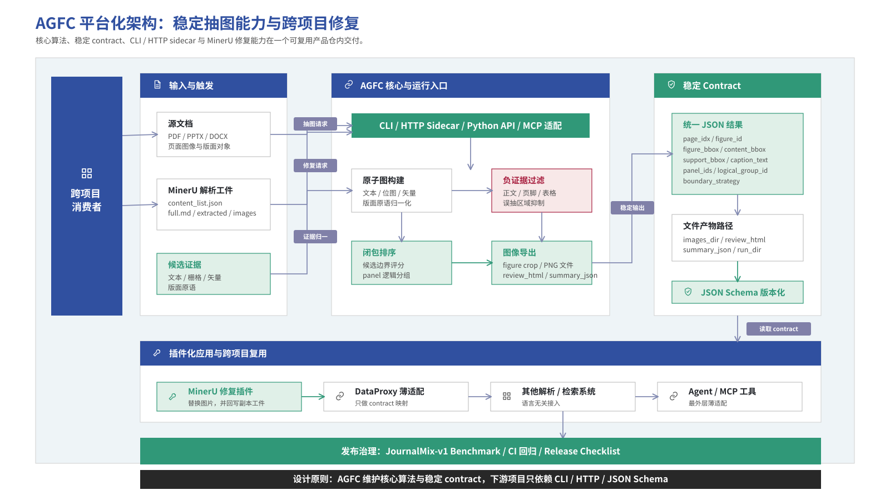

# AGFC

AGFC is a standalone figure extractor for heterogeneous documents. It extracts figure crops from PDFs and exposes stable JSON contracts for use by other projects.

AGFC also provides first-party MinerU artifact repair for image remediation workflows. The MinerU adapter reads MinerU-style artifacts, writes a new repaired bundle, and does not mutate the original parser output.



## Status

This repository is being shaped as a public, demo-first product repo. AGFC v0.1 freezes the current extraction algorithm as a baseline and focuses on stable packaging, contracts, CLI, local service, and MinerU repair.

## What This Repo Delivers

- A standalone `agfc` CLI for figure extraction and MinerU artifact repair
- A local HTTP sidecar service with `/extract` and `/repair/mineru`
- Stable JSON contracts and JSON Schemas under `src/agfc/schemas/`
- First-party MinerU repair that writes a new repaired bundle without mutating original artifacts
- Public-safe generated demos that run without private datasets
- JournalMix-v1 benchmark runner and report format for maintainers with the private benchmark dataset
- Python APIs for projects that intentionally want in-process integration

## Install

```bash
python3 -m venv .venv
source .venv/bin/activate
python3 -m pip install -e .
```

This installs the `agfc` console command.

## Quickstart: Extract Figures

Run the generated public-safe demo:

```bash
agfc demo extract
```

Or run extraction on your own PDF:

```bash
agfc extract --input path/to/file.pdf --output-dir out/extract
```

The command writes:

- `out/extract/extract_result.json`
- `out/extract/summary.json`
- `out/extract/images/`
- `out/extract/pages/`

See [Extract Contract](docs/contracts/extract.md).

## Quickstart: Repair MinerU Artifacts

Run the generated MinerU repair demo:

```bash
agfc demo mineru
```

Or repair an existing MinerU artifact directory:

```bash
agfc repair mineru \
  --source path/to/file.pdf \
  --artifact-dir path/to/mineru_artifact \
  --output-dir out/mineru_repair
```

If you already have an AGFC extraction result, pass it explicitly:

```bash
agfc repair mineru \
  --source path/to/file.pdf \
  --artifact-dir path/to/mineru_artifact \
  --output-dir out/mineru_repair \
  --extract-result out/extract/extract_result.json
```

The repair command writes:

- `out/mineru_repair/mineru_repair_result.json`
- `out/mineru_repair/repaired/content_list.json`
- `out/mineru_repair/postprocessed/merged_content_list.json`
- `out/mineru_repair/postprocessed/merged_full.md`
- `out/mineru_repair/postprocessed/final_images/`

See [MinerU Repair Contract](docs/contracts/mineru-repair.md) and [MinerU Integration](docs/integrations/mineru.md).

## Local HTTP Service

```bash
agfc serve --host 127.0.0.1 --port 8000
```

Routes:

- `GET /health`
- `GET /version`
- `POST /extract`
- `POST /repair/mineru`

See [HTTP Service Contract](docs/contracts/http-service.md).

## JournalMix Benchmark

Maintainers with the private JournalMix-v1 dataset can run:

```bash
agfc benchmark journalmix \
  --dataset-root data/private/journalmix_v1 \
  --output-dir artifacts/benchmarks/journalmix_v1/fresh
```

See [JournalMix-v1 Benchmark](docs/benchmarks/journalmix-v1.md).

## Repository Layout

```text
src/agfc/             AGFC package and public runtime
src/agfc/adapters/    First-party integration adapters
src/agfc/schemas/     JSON Schema files for public contracts
tests/                Automated tests
docs/contracts/       Public contract docs
docs/integrations/    Integration guides
docs/benchmarks/      Benchmark protocols and reference reports
examples/             Runnable demo wrappers
fixtures/             Public-safe fixture notes and generated demo roots
scripts/              Research and benchmark entrypoints
```

## Public Contract Boundary

AGFC public contracts are stable JSON plus file artifact paths. Consumers should not rely on AGFC internal dataclasses or research-only files.

The MinerU repair adapter is intentionally independent of DataProxy internals. DataProxy-style consumers should call AGFC through CLI, HTTP, or Python API, then map AGFC JSON into their own internal types. See [DataProxy-Style Consumer Integration](docs/integrations/dataproxy-style-consumer.md).

## Development

Run the public-surface tests:

```bash
python3 -m pytest \
  tests/test_public_contracts.py \
  tests/test_mineru_repair_adapter.py \
  tests/test_public_cli_extract.py \
  tests/test_public_cli_mineru_repair.py \
  tests/test_public_demo.py \
  tests/test_public_service.py -v
```

Run a small regression subset:

```bash
python3 -m pytest \
  tests/test_project_layout.py \
  tests/test_script_entrypoints.py \
  tests/test_pdf_agfc_export.py \
  tests/test_pdf_agfc_runner_benchmark_mode.py \
  tests/test_pdf_agfc_mineru_dataproxy_adapter.py -v
```

## Scope Notes

AGFC v0.1 productizes the current figure extraction baseline. Known extraction-quality issues should be fixed in AGFC core over time, but major algorithm changes are outside this release packaging pass.
