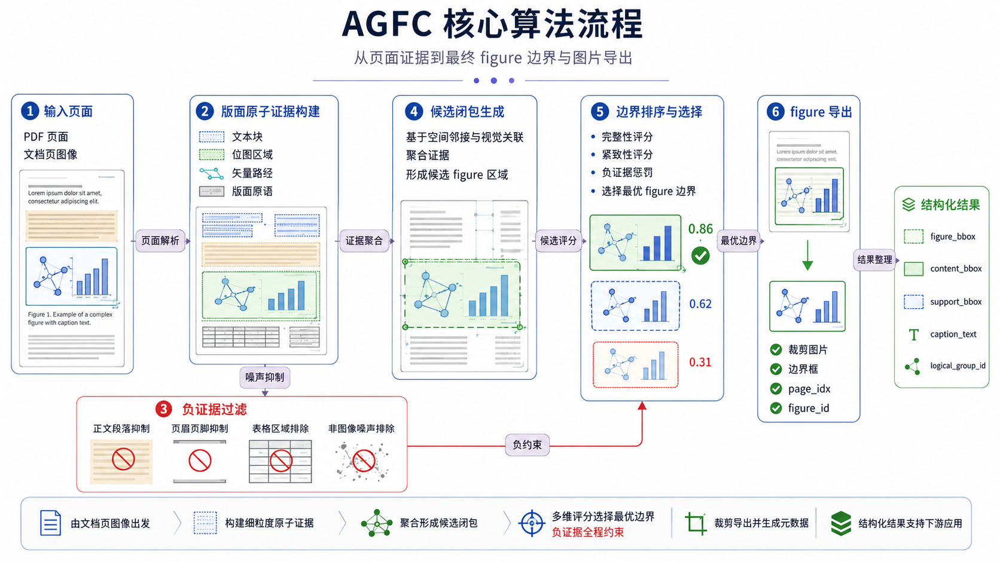

# AGFC

AGFC 是一个面向异构文档的独立 figure extractor，专注从 PDF 中恢复逻辑完整的图片/图形，并以稳定 JSON contract 对外输出，方便其他项目直接复用。

方法上，AGFC 不是直接把整页渲染图送进一个通用模型去回归局部 bbox，也不是把解析器输出的 `image block` 直接当成最终结果；它会从页面中的文本块、位图区域、矢量路径和版面原语构建证据，再经过候选闭包、负证据过滤和边界排序，恢复更接近“完整 figure”的边界。

相较于当前主流的图片抽取方式，例如 MinerU 一类以解析块或局部视觉检测为主的流程，AGFC 更强调逻辑完整图恢复，因此对多面板组图、矢量与栅格混合图、以及紧邻正文的复杂页面更友好。AGFC 同时提供面向 MinerU 解析工件的 first-party repair 能力：读取 MinerU 风格工件，生成一份新的修复结果，而不是原地改写原始解析产物。



英文版说明见 [README.en.md](README.en.md)。

## 当前状态

这个仓库正在收敛成一个公开、可演示、可复用的产品仓。AGFC v0.1 冻结当前抽图算法作为 baseline，重点补齐稳定打包、contract、CLI、本地 service 和 MinerU repair。

## 仓库提供什么

- 独立的 `agfc` CLI，可直接执行 figure extraction 和 MinerU artifact repair
- 本地 HTTP sidecar service，提供 `/extract` 与 `/repair/mineru`
- 稳定 JSON contracts，位于 `src/agfc/contracts/`，对应 JSON Schemas 位于 `src/agfc/schemas/`
- First-party MinerU repair，输出新的 repaired bundle，而不是修改原始工件
- 可直接运行的 public-safe demos，不依赖私有数据
- 面向维护者的 JournalMix-v1 benchmark runner 与报告格式
- 可选的 Python API，适合明确需要 in-process 集成的项目

## 如何使用

- 想直接跑工具：用 `agfc extract` 和 `agfc repair mineru`
- 想给别的系统接入：启动 `agfc serve`，通过 HTTP 调用
- 想先快速体验：先跑 `agfc demo extract` 或 `agfc demo mineru`

## 安装

```bash
python3 -m venv .venv
source .venv/bin/activate
python3 -m pip install -e .
```

安装完成后会提供 `agfc` 命令。

## 快速开始：抽图

运行 public-safe demo：

```bash
agfc demo extract
```

或者对你自己的 PDF 执行抽图：

```bash
agfc extract --input path/to/file.pdf --output-dir out/extract
```

命令会输出：

- `out/extract/extract_result.json`
- `out/extract/summary.json`
- `out/extract/images/`
- `out/extract/pages/`

详见 [Extract Contract](docs/contracts/extract.md)。

## 快速开始：修复 MinerU 工件

运行自带的 MinerU repair demo：

```bash
agfc demo mineru
```

或者修复一个现有的 MinerU artifact 目录：

```bash
agfc repair mineru \
  --source path/to/file.pdf \
  --artifact-dir path/to/mineru_artifact \
  --output-dir out/mineru_repair
```

如果你已经有 AGFC 的抽图结果，也可以显式传入：

```bash
agfc repair mineru \
  --source path/to/file.pdf \
  --artifact-dir path/to/mineru_artifact \
  --output-dir out/mineru_repair \
  --extract-result out/extract/extract_result.json
```

命令会输出：

- `out/mineru_repair/mineru_repair_result.json`
- `out/mineru_repair/repaired/content_list.json`
- `out/mineru_repair/postprocessed/merged_content_list.json`
- `out/mineru_repair/postprocessed/merged_full.md`
- `out/mineru_repair/postprocessed/final_images/`

详见 [MinerU Repair Contract](docs/contracts/mineru-repair.md) 和 [MinerU Integration](docs/integrations/mineru.md)。

## 本地 HTTP Service

```bash
agfc serve --host 127.0.0.1 --port 8000
```

可用路由：

- `GET /health`
- `GET /version`
- `POST /extract`
- `POST /repair/mineru`

详见 [HTTP Service Contract](docs/contracts/http-service.md)。

## JournalMix Benchmark

如果你有本地私有的 JournalMix-v1 数据集，可以运行：

```bash
agfc benchmark journalmix \
  --dataset-root data/private/journalmix_v1 \
  --output-dir artifacts/benchmarks/journalmix_v1/fresh
```

详见 [JournalMix-v1 Benchmark](docs/benchmarks/journalmix-v1.md)。

当前 JournalMix-v1 相关对比建议按三方口径理解：

- `AGFC`
- `MinerU Desktop / Product Client`
- `MinerU token API (vlm)`

相关文档：

- [JournalMix-v1 Dataset](docs/benchmarks/journalmix-v1-dataset.md)
- [JournalMix-v1 vs MinerU](docs/benchmarks/journalmix-v1-vs-mineru.md)
- [MinerU API vs Client](docs/benchmarks/mineru-api-vs-client.md)

仓库内已附带：

- 冻结后的 `JournalMix-v1` 数据集：`data/private/journalmix_v1/`
- HTML 审阅工件 1：`docs/reviews/journalmix-local-mineru-vs-agfc-raw/index.html`
- HTML 审阅工件 2：`docs/reviews/journalmix-mineru-api-vs-client/index.html`

说明：
MinerU 在部分页面上会倾向于把带独立副标题的子图单独拆开抽取。因此当 GT 采用“逻辑完整 figure”边界时，MinerU 分数里会同时混入两类因素：一类是合理的粒度偏差，另一类才是真正的漏检或误检。这一点需要结合页面级审计一起解读。

## 仓库结构

```text
src/agfc/core/        抽图算法核心
src/agfc/runtime/     CLI、service、runner、demos
src/agfc/contracts/   稳定 public contract 构建层
src/agfc/adapters/    MinerU 与第三方集成适配层
src/agfc/research/    JournalMix、corpus、evaluation 工具
src/agfc/schemas/     JSON Schema 文件
tests/                自动化测试
docs/contracts/       public contract 文档
docs/integrations/    集成说明
docs/benchmarks/      benchmark 协议与结果说明
examples/             可运行 demo 包装脚本
fixtures/             public-safe fixture 说明
scripts/              薄脚本入口
```

## Public Contract Boundary

AGFC 对外 contract 是稳定 JSON 加文件产物路径。下游项目不应该依赖 AGFC 内部 dataclass 或 research-only 文件结构。

MinerU repair adapter 也刻意不依赖外部系统的内部类型。下游消费者应该通过 CLI、HTTP 或 Python API 调用 AGFC，再把 AGFC JSON 映射到自己的内部模型。详见 [Consumer Integration](docs/integrations/consumer-integration.md)。

## 开发

运行 public surface 测试：

```bash
python3 -m pytest \
  tests/test_public_contracts.py \
  tests/test_mineru_repair_adapter.py \
  tests/test_public_cli_extract.py \
  tests/test_public_cli_mineru_repair.py \
  tests/test_public_demo.py \
  tests/test_public_service.py -v
```

运行一组较小的回归测试：

```bash
python3 -m pytest \
  tests/test_project_layout.py \
  tests/test_script_entrypoints.py \
  tests/test_pdf_agfc_export.py \
  tests/test_pdf_agfc_runner_benchmark_mode.py \
  tests/test_pdf_agfc_mineru_postprocessed_adapter.py -v
```

## 范围说明

AGFC v0.1 的重点是把当前 figure extraction baseline 产品化。已知的抽图质量问题应该继续在 AGFC core 中修复，但大规模算法升级不属于这次 packaging pass 的范围。
