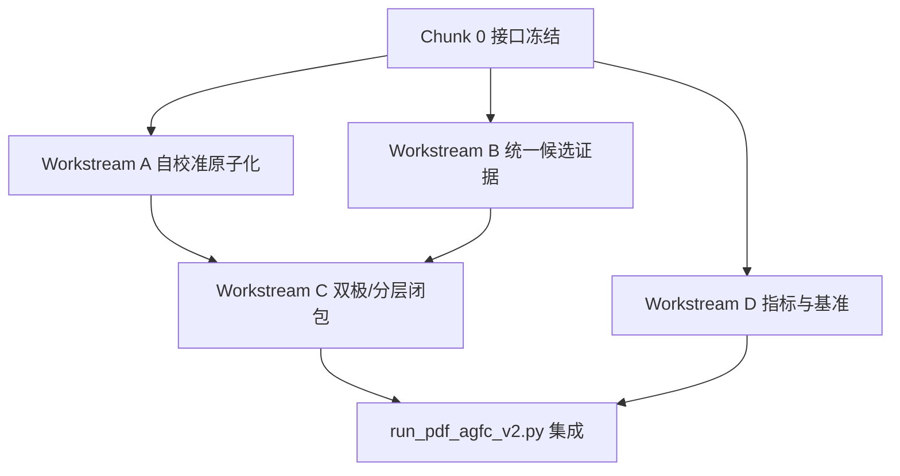

# AGFC-v2 Parallel Implementation Plan

> **For agentic workers:** REQUIRED: Use superpowers:subagent-driven-development (if subagents available) or superpowers:executing-plans to implement this plan. Steps use checkbox (`- [ ]`) syntax for tracking.

**Goal:** 将 `AGFC v1` 升级为可论文表述、可工程扩展的 `AGFC-v2`，重点解决闭包形式化、通用性、召回与评测体系问题，同时通过并行工作流缩短研发周期。

**Architecture:** 以 [`AGFC_v2_正式架构升级方案.md`](/Users/paul/Documents/AI协作/中建科技进步奖/_pdf_agfc_pipeline/AGFC_v2_正式架构升级方案.md) 为总蓝图，先冻结统一接口，再分四条主线并行推进：自校准原子化、统一候选证据、双极闭包、评测与基准。并行阶段禁止多人共享改同一文件，所有高冲突模块必须拆到新文件再开发。

**Tech Stack:** Python 3, PyMuPDF, Pillow, NumPy, JSON/JSONL, pytest, dataclasses

---

## 0. 目标范围

本计划只针对 `_pdf_agfc_pipeline`。

不在本轮计划中处理：

- `MinerU` 对接
- PPT 支持
- 可选 VL 兜底进入主流程
- 端到端训练模型

本轮的唯一目标是：

> 让纯 `AGFC` 从“可工作的原型”升级为“结构统一、理论更清晰、可并行研发的 v2 框架”。

---

## 1. 并行总原则

### 1.1 必须先做的串行阶段

并行开发开始前，必须先冻结以下接口：

1. `TypographyDNA`
2. `LayoutFingerprint`
3. `SeedCandidate`
4. `AttractionEdge / RepulsionEdge`
5. `ClosureResult`
6. 评测样本与 `GT schema`

如果接口不先冻结，后面的并行开发会频繁返工。

### 1.2 并行的最小单元

并行工作不按“功能模糊划分”，而按**文件所有权**划分。

每条工作流必须有独立写入范围。

### 1.3 当前 v1 文件不要继续堆大

现有这些文件只允许做“兼容桥接”，不允许继续变成大杂烩：

- `/Users/paul/Documents/AI协作/中建科技进步奖/_pdf_agfc_pipeline/pdf_agfc_atoms.py`
- `/Users/paul/Documents/AI协作/中建科技进步奖/_pdf_agfc_pipeline/pdf_agfc_panels.py`
- `/Users/paul/Documents/AI协作/中建科技进步奖/_pdf_agfc_pipeline/pdf_agfc_graph.py`
- `/Users/paul/Documents/AI协作/中建科技进步奖/_pdf_agfc_pipeline/pdf_agfc_closure.py`
- `/Users/paul/Documents/AI协作/中建科技进步奖/_pdf_agfc_pipeline/run_pdf_agfc_v1.py`

`v2` 的新能力优先拆到新文件。

---

## 2. 新文件结构

### 核心模型层

- Create: `/Users/paul/Documents/AI协作/中建科技进步奖/_pdf_agfc_pipeline/pdf_agfc_v2_models.py`
  Responsibility: `TypographyDNA`、`LayoutFingerprint`、`SeedCandidate`、`ClosureResult`、`MetricRecord`

### 自校准层

- Create: `/Users/paul/Documents/AI协作/中建科技进步奖/_pdf_agfc_pipeline/pdf_agfc_typography.py`
  Responsibility: 提取 `TypographyDNA`

- Create: `/Users/paul/Documents/AI协作/中建科技进步奖/_pdf_agfc_pipeline/pdf_agfc_layout_fingerprint.py`
  Responsibility: 生成 `LayoutFingerprint` 与相对阈值配置

### 候选证据层

- Create: `/Users/paul/Documents/AI协作/中建科技进步奖/_pdf_agfc_pipeline/pdf_agfc_seed_evidence.py`
  Responsibility: 将现有 `border/layout/image_seed/image_cluster/captioned` 统一转成 `SeedCandidate`

- Create: `/Users/paul/Documents/AI协作/中建科技进步奖/_pdf_agfc_pipeline/pdf_agfc_seed_free.py`
  Responsibility: 无种子社区候选发现（先占位接口，后逐步落实现）

### 图与闭包层

- Create: `/Users/paul/Documents/AI协作/中建科技进步奖/_pdf_agfc_pipeline/pdf_agfc_bipolar_graph.py`
  Responsibility: `E+ / E-` 构建，替代当前弱版本 graph

- Create: `/Users/paul/Documents/AI协作/中建科技进步奖/_pdf_agfc_pipeline/pdf_agfc_bipolar_closure.py`
  Responsibility: 双极闭包固定点求解

- Create: `/Users/paul/Documents/AI协作/中建科技进步奖/_pdf_agfc_pipeline/pdf_agfc_hierarchical_closure.py`
  Responsibility: `L0/L1/L2` 分层闭包

### 评测层

- Create: `/Users/paul/Documents/AI协作/中建科技进步奖/_pdf_agfc_pipeline/pdf_agfc_metrics.py`
  Responsibility: `Fragmentation Rate / Contamination Rate / Overmerge Rate / Structural Completeness`

- Create: `/Users/paul/Documents/AI协作/中建科技进步奖/_pdf_agfc_pipeline/bench/README.md`
  Responsibility: 基准样本组织方式说明

- Create: `/Users/paul/Documents/AI协作/中建科技进步奖/_pdf_agfc_pipeline/bench/gt_schema.json`
  Responsibility: 标注 schema

### Orchestrator

- Create: `/Users/paul/Documents/AI协作/中建科技进步奖/_pdf_agfc_pipeline/run_pdf_agfc_v2.py`
  Responsibility: 统一接入 v2 各模块

---

## 3. 串行阶段：接口冻结

## Chunk 0: Interface Freeze

### Task 0.1: 冻结 v2 核心数据结构

**Files:**
- Create: `/Users/paul/Documents/AI协作/中建科技进步奖/_pdf_agfc_pipeline/pdf_agfc_v2_models.py`
- Test: `/Users/paul/Documents/AI协作/中建科技进步奖/_pdf_agfc_pipeline/tests/test_pdf_agfc_v2_models.py`

- [ ] **Step 1: 写失败测试，固定数据结构字段**

需要测试以下 dataclass：

- `TypographyDNA`
- `LayoutFingerprint`
- `SeedCandidate`
- `BipolarEdge`
- `ClosureResult`
- `MetricRecord`

- [ ] **Step 2: 运行测试，确认当前不存在这些模型**

Run:

```bash
cd '/Users/paul/Documents/AI协作/中建科技进步奖/_pdf_agfc_pipeline'
python3 -m pytest tests/test_pdf_agfc_v2_models.py -v
```

Expected:

- FAIL with missing module or missing symbols

- [ ] **Step 3: 写最小实现**

要求：

- 所有字段含义在 docstring 中明确
- 每个对象都可序列化为 JSON

- [ ] **Step 4: 运行测试，确认通过**

- [ ] **Step 5: 记录接口冻结版本**

在实施日志里记下：

- 所有字段
- 所有命名
- 不允许并行工作流自行改这些字段

### Task 0.2: 冻结评测样本 schema

**Files:**
- Create: `/Users/paul/Documents/AI协作/中建科技进步奖/_pdf_agfc_pipeline/bench/gt_schema.json`
- Create: `/Users/paul/Documents/AI协作/中建科技进步奖/_pdf_agfc_pipeline/bench/README.md`

- [ ] **Step 1: 定义 GT 字段**

至少包含：

- `page_idx`
- `figure_id`
- `bbox`
- `logical_group_id`
- `caption_bbox`
- `body_exclusion_bboxes`
- `panel_bboxes`

- [ ] **Step 2: 落盘 schema 与说明**

Expected:

- 后续评测层不再猜测 GT 结构

---

## 4. 并行工作流

接口冻结后，进入 4 条主线并行。

## Chunk 1: Workstream A - Self-Calibrated Atomization

### Ownership

- Owner files:
  - `/Users/paul/Documents/AI协作/中建科技进步奖/_pdf_agfc_pipeline/pdf_agfc_typography.py`
  - `/Users/paul/Documents/AI协作/中建科技进步奖/_pdf_agfc_pipeline/pdf_agfc_layout_fingerprint.py`
  - `/Users/paul/Documents/AI协作/中建科技进步奖/_pdf_agfc_pipeline/tests/test_pdf_agfc_typography.py`
  - `/Users/paul/Documents/AI协作/中建科技进步奖/_pdf_agfc_pipeline/tests/test_pdf_agfc_layout_fingerprint.py`

### Goal

消除 `v1` 中最危险的绝对阈值来源。

### Deliverables

- `TypographyDNA` 提取器
- 文档级 `Body Fingerprint`
- `LayoutFingerprint`
- 相对阈值函数 `compute_thresholds(fp)`

### Success Criteria

- 当前 `80/40/180/36` 这类绝对阈值都能映射到相对阈值接口
- 至少在 3 类不同版式 PDF 上不需要人工改参数

### Notes

- 这条线不改 closure
- 只产出“自校准参数与特征”

## Chunk 2: Workstream B - Unified Seed Evidence

### Ownership

- Owner files:
  - `/Users/paul/Documents/AI协作/中建科技进步奖/_pdf_agfc_pipeline/pdf_agfc_seed_evidence.py`
  - `/Users/paul/Documents/AI协作/中建科技进步奖/_pdf_agfc_pipeline/pdf_agfc_seed_free.py`
  - `/Users/paul/Documents/AI协作/中建科技进步奖/_pdf_agfc_pipeline/tests/test_pdf_agfc_seed_evidence.py`
  - `/Users/paul/Documents/AI协作/中建科技进步奖/_pdf_agfc_pipeline/tests/test_pdf_agfc_seed_free.py`

### Goal

把当前 `panel_kind` 分支重构成统一的 `SeedCandidate` 证据层。

### Deliverables

- `border/layout/image_seed/image_cluster/captioned_image` → 统一 `SeedCandidate`
- 占位版 `seed-free discovery`
- `provenance + evidence_tags + score`

### Success Criteria

- 当前所有候选生成器都不再直接输出 panel 作为最终候选
- 新旧候选都统一可排序、可过滤、可审计

### Notes

- 这条线不做最终图合并
- 只解决候选表达统一问题

## Chunk 3: Workstream C - Bipolar + Hierarchical Closure

### Ownership

- Owner files:
  - `/Users/paul/Documents/AI协作/中建科技进步奖/_pdf_agfc_pipeline/pdf_agfc_bipolar_graph.py`
  - `/Users/paul/Documents/AI协作/中建科技进步奖/_pdf_agfc_pipeline/pdf_agfc_bipolar_closure.py`
  - `/Users/paul/Documents/AI协作/中建科技进步奖/_pdf_agfc_pipeline/pdf_agfc_hierarchical_closure.py`
  - `/Users/paul/Documents/AI协作/中建科技进步奖/_pdf_agfc_pipeline/tests/test_pdf_agfc_bipolar_graph.py`
  - `/Users/paul/Documents/AI协作/中建科技进步奖/_pdf_agfc_pipeline/tests/test_pdf_agfc_bipolar_closure.py`
  - `/Users/paul/Documents/AI协作/中建科技进步奖/_pdf_agfc_pipeline/tests/test_pdf_agfc_hierarchical_closure.py`

### Goal

把当前 `same_row` 主导闭包升级为：

- `E+ / E-`
- 最小固定点闭包
- 分层闭包

### Deliverables

- 吸引边与排斥边建模
- `body_text_barrier`
- `whitespace_barrier` 占位接口
- `L0/L1/L2` 闭包 API

### Success Criteria

- 纵向组图可以被合并
- 正文污染可以通过排斥边被排除
- 不再只依赖 `same_row`

### Notes

- 这条线依赖 Chunk 0 的接口冻结
- 最好在 Workstream A 的 `Text DNA` 初版完成后再接 `body_text_barrier`

## Chunk 4: Workstream D - Metrics And Benchmark

### Ownership

- Owner files:
  - `/Users/paul/Documents/AI协作/中建科技进步奖/_pdf_agfc_pipeline/pdf_agfc_metrics.py`
  - `/Users/paul/Documents/AI协作/中建科技进步奖/_pdf_agfc_pipeline/tests/test_pdf_agfc_metrics.py`
  - `/Users/paul/Documents/AI协作/中建科技进步奖/_pdf_agfc_pipeline/bench/*`

### Goal

建立 AGFC 的论文级评测体系。

### Deliverables

- `Fragmentation Rate`
- `Contamination Rate`
- `Overmerge Rate`
- `Structural Completeness`

### Success Criteria

- 指标能在 JSON GT 上自动计算
- 至少对当前中建科技进步奖 PDF 做出第一版 benchmark

### Notes

- 这条线几乎可完全并行
- 不依赖 closure 实现完成后再开始

---

## 5. 并行依赖图



解释：

- `A/B/D` 可以并行
- `C` 需要消化 `A + B` 的接口结果
- 最终统一在 `run_pdf_agfc_v2.py` 合流

---

## 6. 禁止共享修改清单

以下文件在并行阶段禁止多人同时修改：

- `/Users/paul/Documents/AI协作/中建科技进步奖/_pdf_agfc_pipeline/pdf_agfc_v2_models.py`
- `/Users/paul/Documents/AI协作/中建科技进步奖/_pdf_agfc_pipeline/run_pdf_agfc_v2.py`
- `/Users/paul/Documents/AI协作/中建科技进步奖/_pdf_agfc_pipeline/bench/gt_schema.json`

这些文件只能在合流阶段由主控工作流修改。

---

## 7. Merge 节奏

建议每条工作流独立提交小步成果，节奏如下：

1. 冻结接口
2. 每条线先红绿一轮最小测试
3. 每完成一个模块就跑该线局部测试
4. 每天一次合流分支：
   - 只做 rebase / 兼容
   - 不做大重构

建议合流验证命令：

```bash
cd '/Users/paul/Documents/AI协作/中建科技进步奖/_pdf_agfc_pipeline'
python3 -m pytest tests -v
```

---

## 8. 推荐先后顺序

如果资源有限，推荐这样排：

1. `Chunk 0`
2. `Workstream A`
3. `Workstream B`
4. `Workstream D`
5. `Workstream C`
6. `run_pdf_agfc_v2.py` 合流

理由：

- 先消灭 magic numbers
- 再统一候选接口
- 再做正式闭包

---

## 9. 完成标准

当以下条件同时满足时，`AGFC-v2` 第一阶段并行研发可视为完成：

1. 绝对阈值已被 `LayoutFingerprint` 接管
2. 所有候选器统一输出 `SeedCandidate`
3. 闭包不再只依赖 `same_row`
4. `Fragmentation Rate / Contamination Rate` 可自动评测
5. `run_pdf_agfc_v2.py` 能在当前 PDF 上跑出结果
6. 所有测试通过

---

## 10. 当前建议

立即执行的最优动作是：

1. 先写 `pdf_agfc_v2_models.py`
2. 再把 `Text DNA` 和 `LayoutFingerprint` 作为第一条并行主线启动
3. 同时让另一条线开始 `SeedCandidate` 统一接口改造

这会比继续给 `v1` 叠候选规则更高效，也更符合最终论文目标。
