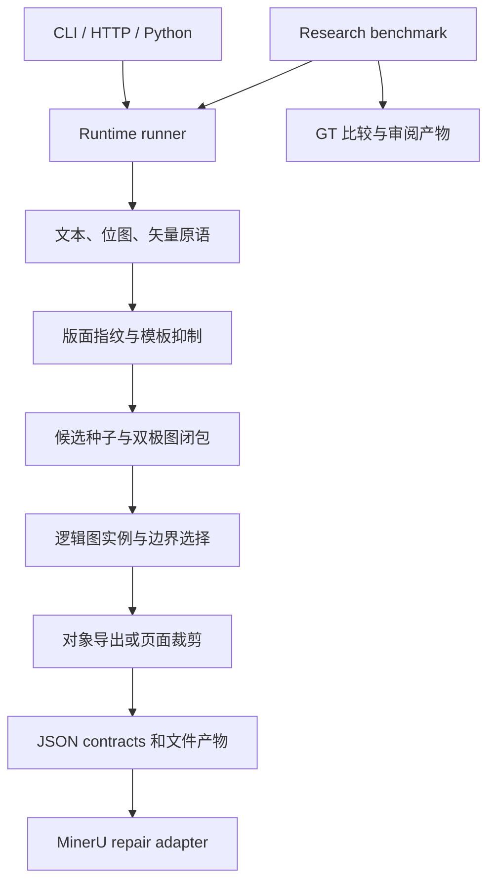

# AGFC v0.1.1 架构、代码质量与版本固定审计

日期：2026-09-08。目标分支：`feat/public-product-repo`。起点：`686748b3c481050ae8880d9b62ecf6168c3fbb66`，并纳入审计开始前已存在的本地中文标注、图号、边界和 MinerU 修复。版本固定使用包版本与 Git 标签 `v0.1.1`，运行时固定 PyMuPDF 1.26.5 / Pillow 11.3.0，开发环境由 `uv.lock` 锁定。

## 结论与范围

已处理本轮确认的产品入口、输出完整性、重复代码、发布配置和基准来源问题。保留现有算法架构与兼容导入，并以完整单元/集成测试、真实 HTTP 请求、安装包冒烟测试、中文导出像素检查和 JournalMix 回归验证变更。本报告不等于对任意 PDF 的正确性保证，也不将固定数据集上的分数解释为未知文档泛化能力。

审查范围包括 `core`、`runtime`、`contracts`、`adapters`、`research`、兼容转发模块、脚本、测试、打包、CI 和数据集索引。核心调用路径和高风险 I/O 进行了人工审查；整个 Python 源码与测试进行了静态检查、函数引用和重复 AST 检查。未调用付费外部解析 API。

## 架构梳理

- `core`：35 个模块，约 1.45 万行。文本/图元证据 → 候选生成 → 图闭包 → 逻辑图归并 → 边界与导出。`figure_instances` 和 `pipeline` 承担较多规则，是后续维护的主要复杂度来源。
- `runtime`：CLI、HTTP、runner、demo，以及统一输出目录策略。benchmark 依赖改为命令执行时加载，普通产品入口不再提前加载研究报告模块。
- `contracts`：将内部产物转换为稳定 JSON；现在严格要求实际存在的 summary、figure records 和精确匹配的图片文件。
- `adapters`：first-party MinerU 工件修复与可选第三方 HTTP 集成。HTTP 依赖通过 `integrations` extra 显式提供。
- `research`：数据集选择、评估、比较与可视化。与公共契约分开保留，因为 benchmark 和维护脚本仍在调用。
- 顶层旧模块多为 `sys.modules` 转发，不持有算法副本。它们有明确测试和下游兼容用途，本次不删除。

模块数量与行数快照、逐页回归摘要见 [验证记录](v0.1.1-validation.json)。

## 已确认的问题与处理

| 优先级 | 问题、触发条件与影响 | 修复与证据 |
| --- | --- | --- |
| P1 | runner / benchmark 对传入目录无条件 `rmtree`，可能删除源 PDF 或其他文件 | 合并为新目录/空目录校验；拒绝符号链接和已有内容。新增保留源文件与哨兵文件的回归 |
| P1 | PDF 不存在时 `SystemExit` 可结束 HTTP 进程；非法请求长度、编码与引擎异常缺少完整处理 | 库抛出普通异常；HTTP 返回 400/408/413/500 JSON，设置连接超时和 1 MiB 请求上限；真实 socket 请求验证 |
| P1 | 内嵌位图直接导出遗漏 PDF 叠加文字、矢量标注；无效透明蒙版仍被忽略 | 检查页面组合、裁剪和变换，必要时回退完整渲染；蒙版失败也回退。中文叠加图与渲染裁剪逐像素一致，并目视检查 |
| P1 | GT/meta 更新后索引未同步；私有隧道页错误映射到另一篇 PDF；越界页被静默跳过 | 两份索引各纠正 76 行，以现有 GT/meta 为准；修复来源解析；缺失来源/无效页码显式报错；GT 未变 |
| P2 | MinerU 全局槽位回退可能重复使用已匹配图片，或跨页选错图片 | 删除槽位回退；只按同页序号匹配，缺少匹配则保留原图；覆盖复用和跨页场景 |
| P2 | repaired JSON 的图片路径实际基于另一个目录；保留原图未复制；原生 `img_path` 可能过时 | 按每个 JSON 所在目录写相对路径，复制可用原图并更新 `img_path`；禁止修复输出与原始工件目录重叠 |
| P2 | 抽图契约对缺失产物返回空数据或按文件顺序猜测另一张图 | 删除位置回退和静默缺省；不完整产物直接报错，防止输出成功但对应错误图片 |
| P2 | 旋转页的文本坐标与渲染坐标不一致 | 仅在内存中归零页旋转，再统一抽取和渲染；验证旋转/非旋转版本图元与边界一致、原文件旋转信息不变 |
| P2 | `setup.py` 和 `pyproject.toml` 两处维护版本/依赖/入口，CI 没有测试依赖且未覆盖产品分支 | 删除旧 setup.py，以 pyproject 为唯一打包配置；版本 0.1.1；锁定开发依赖并增加 Python 3.9/3.11/3.13 CI 与 wheel 冒烟 |
| P2 | 图内中文短标签、分级图号、并排图题和完整图边界问题仍仅在本地 | 将已有修复纳入发布；中文标签、`图 3.2` 等图号、并排 caption 与防止非栅格碎片替换完整图的回归一并保留 |

## 删除与合并清单

- 删除 `setup.py`：无受支持工作流依赖它；PEP 517 构建、包 metadata 与 console script 全部由 `pyproject.toml` 提供。
- 删除 `_semantic_annotation_component_rank`：引用扫描与全文检查未发现调用，属于遗留排序实现。
- 删除无用的 `atom_by_id` 局部变量和 16 处未使用导入；保留其他实际使用的同名变量。
- 删除 runner、三个 benchmark 模块和打包脚本中的重复递归目录清理实现，统一使用 `runtime/output.py`。
- 将四个 HTTP 适配器完全相同的坐标转换合并到 `adapters/integrations/geometry.py`。
- 将三个完全相同的连通分量遍历合并到 `core/graph_utils.py`。
- 删除新增 caption 拆分逻辑中的重复正则定义，复用 figure scope 的图号规则。
- 删除 MinerU 全局槽位匹配回退、contract 图片文件位置猜测，以及缺失产物的静默空结果分支。

未为了减少文件数量删除兼容转发、仍被调用的 research 工具或既有回归测试。几何/文本规则中还有一些相似但语义不完全相同的辅助函数；没有仅凭名字相似强行合并，以免改变边界算法。

## 验证

- 起始工作树：488 项测试通过。
- 发布回归：覆盖旧测试与新增真实 HTTP、文件保护、私有来源缺失、索引一致性、旋转页、中文/矢量叠加、蒙版失败、路径完整性和 JSON Schema 场景。最终 Python 3.9 / 3.11 / 3.13 均为 515 项通过；固定依赖后的 Python 3.13 完整基准也恢复到 106/106 匹配。
- 静态检查：`ruff` 的 F401、F811、F821、F841，全源码和测试通过；`git diff --check` 通过。
- 完整 JournalMix：相同 GT、相同修正后的索引、相同本地隧道源映射，审计前后各跑一遍。84 页、106 GT、106 预测、106 匹配；precision / recall / F1 均为 1.0，平均匹配 IoU 0.9657，逐页结果无变化。
- 初次使用旧来源映射得到的 F1 0.9565 已作废，不作为发布证据。
- GT 文件未修改；数据索引和 manifest 只依据已有 GT/meta 对齐，按数据集约定记为元数据修订 v1.1 并追加 freeze log。当前为 24 个 document ID；类别数量详见 manifest。
- 中文叠加标注 PNG 已目视核对“拱顶、左拱腰、右拱腰、测线”；自动测试另验证与完整页面裁剪的像素一致性。这是合成回归样例，不声称覆盖所有中文 PDF。
- sdist/wheel 构建与脱离源树运行 demo 用于验证真实安装；可选外部 API 仅以适配器测试验证，没有进行线上端到端调用。

新版依赖实验：Python 3.13 + PyMuPDF 1.28.0 / Pillow 12.3.0 的单元测试通过，但 JournalMix 仅 105/106 匹配（F1 0.9906，IoU 0.954）。因此该依赖组合未进入固定版本，运行时依赖采用精确版本约束，而不仅是最低版本范围。

## 兼容性与剩余边界

1. 已有非空输出目录现在报错。重复运行需使用新目录；不提供隐式覆盖或删除。
2. `pages=[]`、负页码、越界页码属于错误；不再按“所有页”或静默跳过处理。
3. MinerU `match_policy.fallback` 变为空数组；`repaired/content_list.json` 图片路径修正为相对该文件的位置。使用者应解析路径，不应硬编码旧目录关系。
4. MinerU 仍是同页序号匹配，不是版面语义匹配。若两个解析器对组图拆分粒度不同，仍需要结果审阅；缺失的原图文件不能凭空恢复。
5. HTTP 是串行可信本地 sidecar，没有身份认证、PDF 工作进程隔离或 CPU/内存配额。请求体限制不能替代引擎资源隔离；本版本保持默认 loopback 定位。
6. 抽图核心仍包含经验阈值和领域文本规则；大型规则模块未来可以按边界证据职责逐步拆分，本次不进行未经完整质量数据支撑的算法重构。
7. 完整数据集中的 `jm_0050` 需要本地私有源文件，源映射被 gitignore 排除。新克隆可显式选取其余 83 页；不得将两种样本口径混为一谈。
8. 两个审计开始前已存在的未跟踪 PDF 不属于发布包，本次不上传。
