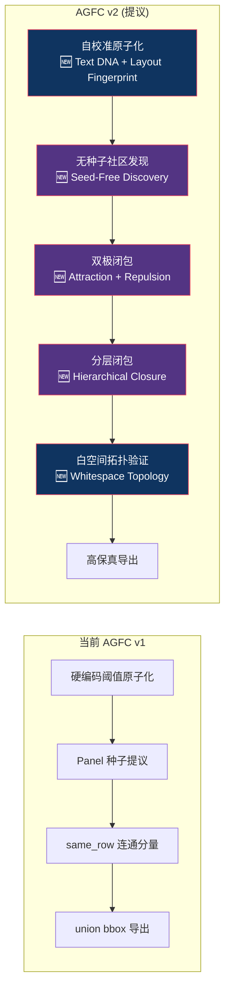
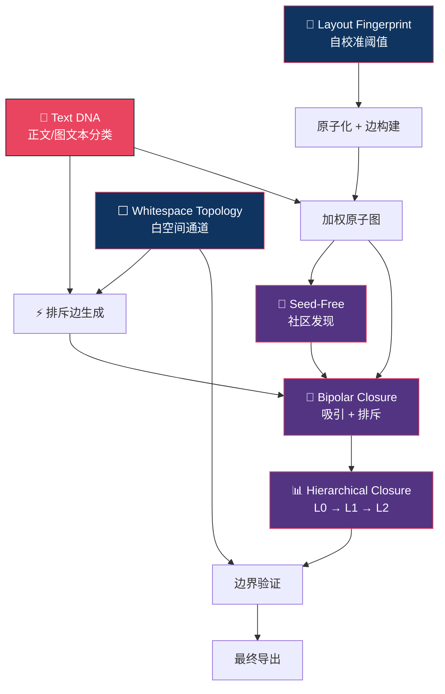

# AGFC 通用化创新改进方案

> 目标：将 AGFC 从"单文档验证原型"升级为"PDF 图片抽取的通用工具"  
> 原则：每一项改进都必须在论文中构成一个可独立阐述的技术贡献

---

## 改进总览



---

## 创新点一：Text DNA Fingerprinting（文本排印指纹）

### 问题

当前判断文本原子是"正文"还是"图内文字"完全依赖 **几何距离**（`_near_body_text` 用 80pt gap 判断）。这在以下场景必然失败：

- 图与正文紧贴（gap < 10pt 的紧凑版式）
- 图内含有大段描述文字（被误判为 body_text）
- 跨栏版式中，图跨栏但正文不跨栏

### 核心 Insight

> **正文在整份文档中具有高度一致的排印风格（字体、字号、行距、段宽），而图内文字几乎总是"排印异常值"。**

不需要任何模型——只需要做统计。

### 方法

**Step 1：提取每个 text block 的排印特征向量（Typography Feature Vector）**

```python
@dataclass
class TypographyDNA:
    dominant_font_size: float      # 块内主导字号
    font_size_variance: float      # 字号变异系数
    dominant_font_name: str        # 主导字体名
    line_spacing_ratio: float      # 行距 / 字号
    block_width_ratio: float       # 块宽 / 页面文本区宽度
    char_density: float            # 字符数 / 块面积
    avg_line_length: int           # 平均行字符数
    is_single_line: bool           # 是否单行
```

**Step 2：建立文档级"正文指纹"（Body Text Fingerprint）**

对全文档所有 text block 的 TypographyDNA 做聚类（不需要复杂算法，用众数即可）：

```
body_fingerprint = {
    font_size: mode(all_blocks.font_size),      # 如 10.5pt
    font_name: mode(all_blocks.font_name),      # 如 "宋体"
    width_ratio: median(top_80%_blocks.width),   # 如 0.85
    line_spacing: median(all_blocks.spacing),    # 如 1.5
}
```

**Step 3：每个 text block 计算与 body_fingerprint 的 "排印距离"**

```
typographic_distance(block, body_fingerprint) = 
    w₁ · |block.font_size - body.font_size| / body.font_size +
    w₂ · (1 if block.font_name ≠ body.font_name else 0) +
    w₃ · |block.width_ratio - body.width_ratio| +
    w₄ · block.is_single_line
```

距离小 → body_text（高置信度排除）  
距离大 → figure_text 或 caption 候选

### 为什么有创新性

- **零模型、零训练**：纯统计方法
- **文档自适应**：每份文档自动校准，不需要预设阈值
- **有形式化基础**：可以用 Mahalanobis 距离 + 异常检测理论包装
- 现有文献（PDFFigures 2.0、MinerU）都没有做过文档级排印指纹比对

---

## 创新点二：自校准布局指纹（Layout Fingerprint Self-Calibration）

### 问题

当前原子分类和 panel 提议中的所有阈值都是绝对值：

```python
# 这些 magic number 在换一种版式后全部失效
width >= 80.0 and height >= 80.0    # panel_border
width >= 80.0 and height >= 12.0    # color_band  
width >= 180.0 and height >= 180.0  # image_seed
gap <= 40.0                          # image_cluster
```

### 核心 Insight

> **不同 PDF 有不同的"布局语法"。一个 A4 双栏论文和一个 A3 海报的"大图"定义完全不同。但每份文档内部，布局元素的尺寸分布是自洽的。**

### 方法

**Step 1：扫描全文档，提取布局统计量**

```python
@dataclass
class LayoutFingerprint:
    page_width: float
    page_height: float
    text_region_width: float         # 正文区宽度（去除页边距）
    text_region_columns: int         # 栏数
    column_width: float              # 单栏宽度
    column_gap: float                # 栏间距
    body_font_size: float            # 正文字号
    median_text_block_height: float  # 正文块中位高度
    median_paragraph_gap: float      # 段间距中位数
```

**Step 2：所有阈值表达为 LayoutFingerprint 的函数**

```python
def compute_thresholds(fp: LayoutFingerprint) -> AtomThresholds:
    return AtomThresholds(
        panel_border_min_size = fp.column_width * 0.3,        # 不再是 80pt
        color_band_min_width  = fp.column_width * 0.3,
        color_band_min_height = fp.body_font_size * 1.2,      # 不再是 12pt
        image_seed_min_size   = fp.column_width * 0.6,        # 不再是 180pt
        cluster_max_gap       = fp.column_gap * 1.5,          # 不再是 40pt
        near_text_max_gap     = fp.median_paragraph_gap * 3,  # 不再是 80pt
    )
```

### 为什么有创新性

- **将"参数调优"问题转化为"文档自校准"问题**——这是一个范式转变
- 可以形式化表述为 **"relative threshold theory"**：所有判据都是相对于文档布局基准的比例，而非绝对值
- 直接解决了通用性问题的根源

---

## 创新点三：双极闭包（Bipolar Closure）— Attraction + Repulsion

### 问题

当前闭包只有"吸引力"（same_row → 合并），没有"排斥力"。这导致：

- 两个不相关的图只因为在同一行就被强制合并
- 正文块如果不小心进入闭包范围，无法被排斥出去

### 核心 Insight

> **逻辑完整图的边界不仅由"什么应该在一起"决定，也由"什么绝对不应该在一起"决定。闭包需要同时有吸引边和排斥边。**

### 形式化

```
定义 Bipolar Atom Graph:
  G = (V, E⁺, E⁻)
  - E⁺: 吸引边 (attraction edges) — same_row, same_column, contains, attachment
  - E⁻: 排斥边 (repulsion edges) — text_body_boundary, semantic_discontinuity

定义 Bipolar Closure:
  Cl(S) = { v ∈ V | ∃ path P from S to v via E⁺, 
                     AND ∄ edge e ∈ E⁻ cutting P }

即：闭包沿吸引边传播，但被排斥边截断。
```

### 排斥边的来源

| 排斥边类型 | 触发条件 | 直觉 |
|---|---|---|
| `body_text_barrier` | Text DNA 判定为正文 + 位于两个 panel 之间 | 正文段落切断组图传播 |
| `column_boundary` | 两个 panel 跨栏且中间有栏间白空间 | 栏间隔切断 |
| `font_discontinuity` | 相邻文本块字号/字体突变 | 排印风格断裂 |
| `large_gap` | 元素间距 > 3× median_paragraph_gap | 过大间距切断 |

### 为什么有创新性

- **现有图闭包文献基本只处理单极（吸引）传播**，引入排斥边构成 "bipolar closure" 是一个新概念
- 对应到物理学的"吸引-排斥势场"类比，理论包装空间大
- 直接解决了"closure 是否会过度合并"这个关键问题

---

## 创新点四：无种子社区发现（Seed-Free Figure Discovery）

### 问题

当前系统严重依赖 panel seed：先找到 panel_border、color_band、image_seed，然后以它们为种子向外闭包。但很多 PDF 的图**没有明显的视觉边框**：

- 无框线的照片排列
- 纯矢量的流程图（没有外框）
- 图表区域（axes + data points，无 panel_border）

此时 panel 候选为空 → **整页图检测失败，recall 为 0**。

### 核心 Insight

> **图区域在原子图上表现为"高密度社区"——图内元素之间的关系（空间邻近、类型多样）比图与正文之间更密集。可以用社区发现算法直接找到图区域，不需要预设种子。**

### 方法

**在构建完原子关系图后，对图做社区发现：**

```
Step 1: 构建加权原子图 G = (V, E, w)
  - 节点 = 所有原子
  - 边 = 空间邻近 + 类型兼容
  - 权重 = f(距离, 类型兼容性, 排印相似度)

Step 2: 排除高置信度正文节点
  - 用 Text DNA fingerprint 排除 body_text 节点
  - 剩余节点构成 "非正文子图" G'

Step 3: 对 G' 做社区发现
  - 可用 Louvain / Label Propagation / Spectral Clustering
  - 每个社区 = 一个 figure candidate

Step 4: 用闭包验证
  - 对每个社区做 bipolar closure，吞并附属元素，排斥正文
```

### 为什么有创新性

- **消除了对 seed 的依赖**——当前方法最大的 recall 瓶颈
- 将文档理解与 **图论中的社区发现（community detection）** 建立了桥梁——这是一个全新的 cross-domain 连接
- 可以和 seed-based 方法做 ensemble：seed-based 高精度 + seed-free 高召回

---

## 创新点五：白空间拓扑（Whitespace Topology）

### 问题

当前系统只看"有东西的区域"（原子），完全不看"没东西的区域"（白空间）。但白空间蕴含了极其重要的布局信息。

### 核心 Insight

> **在排版良好的 PDF 中，图区域与正文之间总存在一条连续的"白空间通道"。这条通道构成了图的自然边界。**

可以类比为：**原子是陆地，白空间是河流。河流天然划分了不同的陆地区域。**

### 方法

```
Step 1: 将页面栅格化为 cell grid（例如 10pt × 10pt）
Step 2: 将每个 cell 标记为 "occupied" 或 "empty"
Step 3: 对 empty cells 做连通域分析
Step 4: 识别"白空间通道"— 连续的 empty 区域，宽度 ≥ 阈值
Step 5: 白空间通道作为排斥边注入 Bipolar Closure
```

**关键应用场景**：

| 场景 | 白空间拓扑的作用 |
|---|---|
| 图与正文紧贴 | 即使 gap 很小，白空间通道的拓扑结构仍然不同 |
| 双栏版式中图跨栏 | 栏间白空间通道消失 → 说明图跨越了栏 |
| 浮动图 | 图周围被白空间包围 → 容易识别为独立区域 |

### 为什么有创新性

- PDFFigures 2.0 用过白空间分析，但只做了**矩形切割**（水平/垂直 cut）
- 提出**拓扑分析**（连通域、通道、骨架）是更一般化的理论框架
- 白空间作为"negative space"参与图建模，在文档理解领域非常少见

---

## 创新点六：分层闭包（Hierarchical Closure）

### 问题

当前闭包是"一步到位"——直接从 panel 求一次连通分量就出结果。但真实的图有**层次结构**：

```
逻辑完整图
├── 子图组 A (左半部分)
│   ├── 子面板 (a)
│   ├── 子面板 (b)  
│   └── 共享 X 轴标签
├── 子图组 B (右半部分)
│   ├── 子面板 (c)
│   └── 子面板 (d)
└── 共享图题 "Figure 1: ..."
```

一步闭包无法表达这种层次。

### 方法

**定义三级闭包**：

```
Level 0 — Element Closure:  原子→子面板
  - 将紧邻的同类型原子合并（如相邻矢量路径 → 一个矢量图块）
  - 闭包谓词：类型相同 + 间距 < body_font_size

Level 1 — Panel Closure:  子面板→面板组
  - 将共享标题/说明条/坐标轴的子面板合并
  - 闭包谓词：attachment_edge + same_row/same_column

Level 2 — Figure Closure:  面板组→逻辑完整图
  - 将共享图题、图注的面板组合并
  - 闭包谓词：caption_attachment + visual_continuity
  - 白空间拓扑验证：合并后的区域边界是否有白空间通道
```

### 论文价值

- 输出不仅是图的边界，还有**图的内部层次结构**
- 可以同时满足两种下游需求：
  - "给我整张完整图" → Level 2 输出
  - "给我每个子面板" → Level 1 输出
- 这种层次化的 figure representation 在文献中没有先例

---

## 六个创新点的协同关系



**协同逻辑**：
1. **Layout Fingerprint** 让原子化自适应 → 通用性
2. **Text DNA** 精确分离正文 → 生成排斥边
3. **Seed-Free** 解决无框图的 recall → 与 seed-based 互补
4. **Bipolar Closure** 统一吸引/排斥 → 理论优雅性
5. **Whitespace Topology** 提供独立验证信号 → 鲁棒性
6. **Hierarchical Closure** 输出层次结构 → 丰富表达力

---

## 建议优先级排序

| 优先级 | 创新点 | 实现难度 | 论文价值 | 理由 |
|---|---|---|---|---|
| 🥇 P0 | **Text DNA Fingerprinting** | 低（纯统计） | ⭐⭐⭐⭐⭐ | 解决最核心的正文隔离问题，零成本实现 |
| 🥇 P0 | **Layout Fingerprint Calibration** | 低（统计+比例） | ⭐⭐⭐⭐⭐ | 解决通用性的根本瓶颈 |
| 🥈 P1 | **Bipolar Closure** | 中（需重构闭包） | ⭐⭐⭐⭐⭐ | 理论贡献最大，形式化最优雅 |
| 🥈 P1 | **Seed-Free Discovery** | 中（加社区发现） | ⭐⭐⭐⭐ | 解决 recall 瓶颈 |
| 🥉 P2 | **Whitespace Topology** | 中（栅格化+连通域） | ⭐⭐⭐⭐ | 独立验证信号，增强鲁棒性 |
| 🥉 P2 | **Hierarchical Closure** | 高（多级重构） | ⭐⭐⭐⭐ | 输出更丰富，但实现复杂 |

> [!TIP]
> **建议先实现 P0 两项（Text DNA + Layout Fingerprint）**，它们实现难度最低（纯统计，不需要任何模型），但对通用性的提升最直接。完成后就可以在多种 PDF 上验证，快速积累实验数据。

---

## 与 SCI 论文的对应关系

如果六项全部实现，论文的 contribution list 变为：

```
1. 我们提出将 PDF figure extraction 重新定义为原子图上的语义闭包问题 (AGFC)
2. 我们提出 Text DNA Fingerprinting，实现零模型的正文/图文本分离
3. 我们提出 Layout Fingerprint Self-Calibration，消除所有绝对阈值
4. 我们提出 Bipolar Closure 理论，统一处理吸引与排斥传播
5. 我们提出 Seed-Free Figure Discovery，用社区发现消除对种子的依赖
6. 我们构建了 AGFC-Bench，包含 X 页 Y 个 GT figure 的评测基准
```

这样的 contribution 密度和理论深度足以支撑 **Pattern Recognition / Information Fusion / ACM MM** 级别的投稿。
